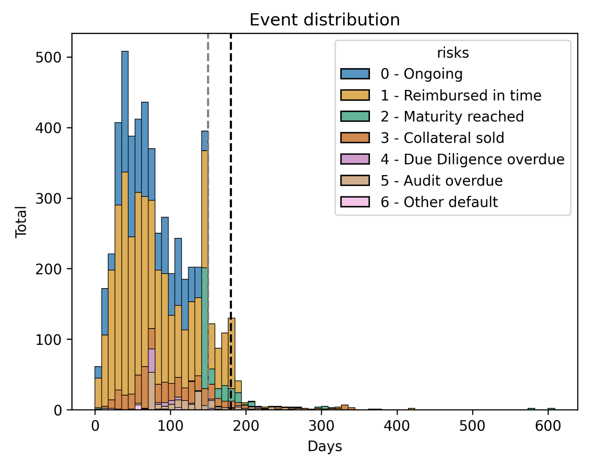
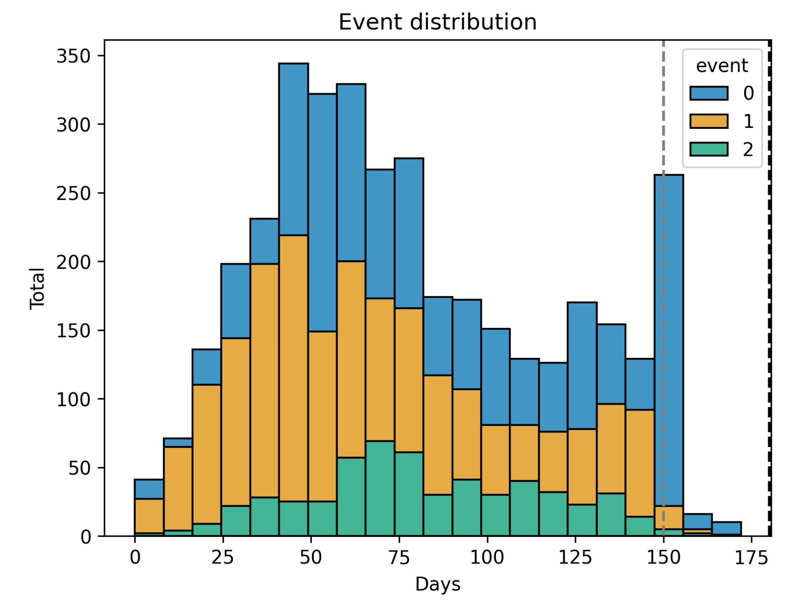
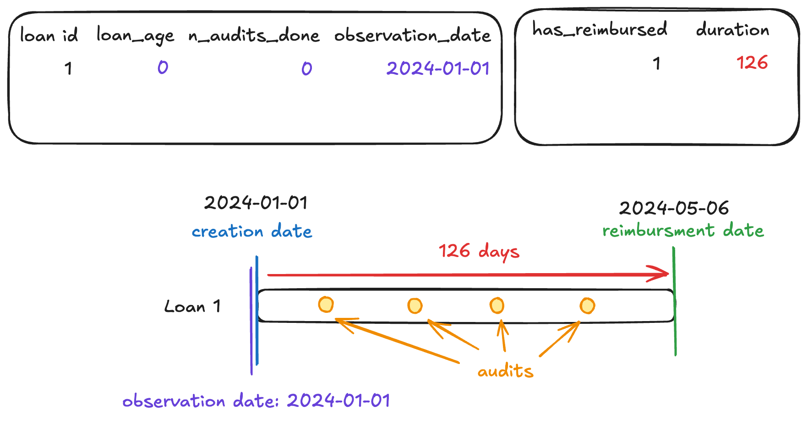
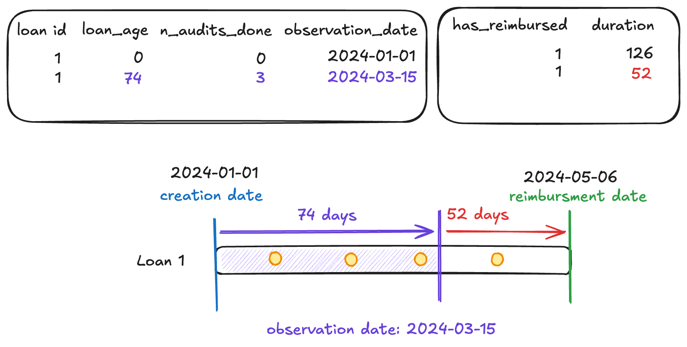
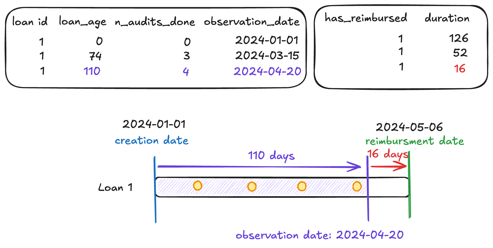
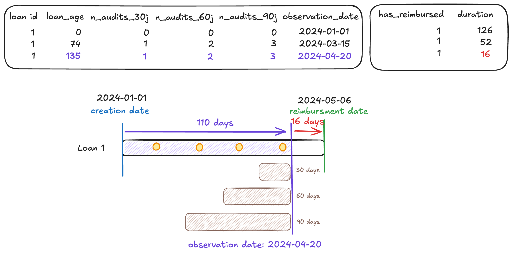
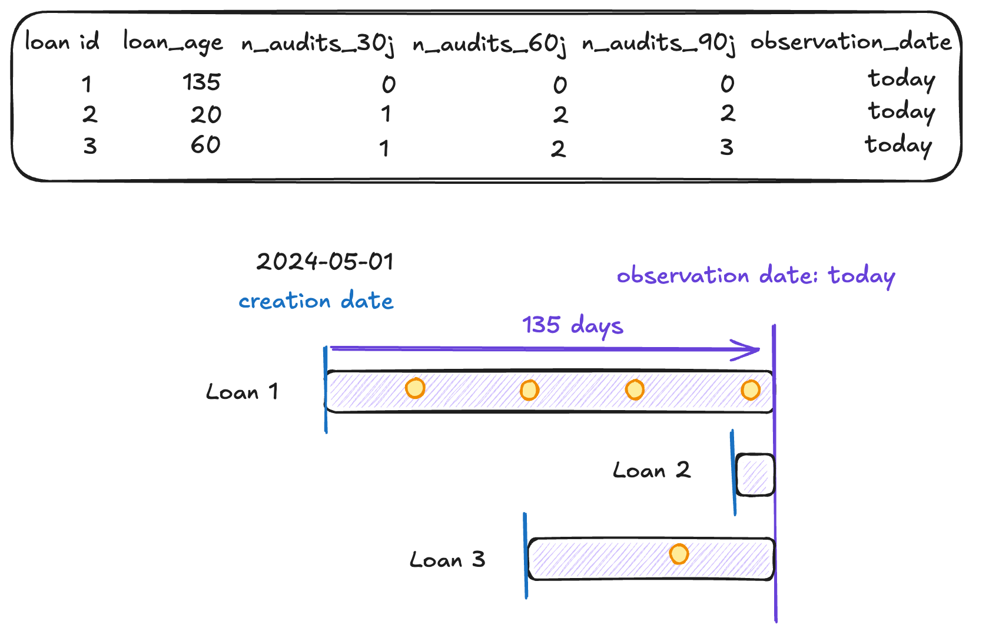
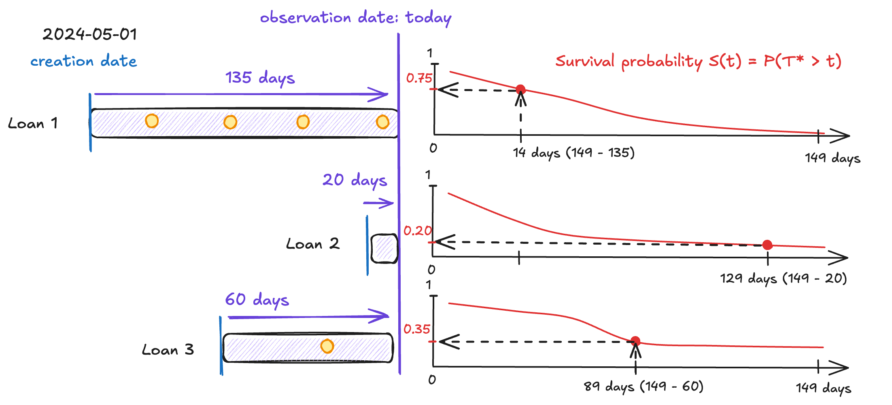
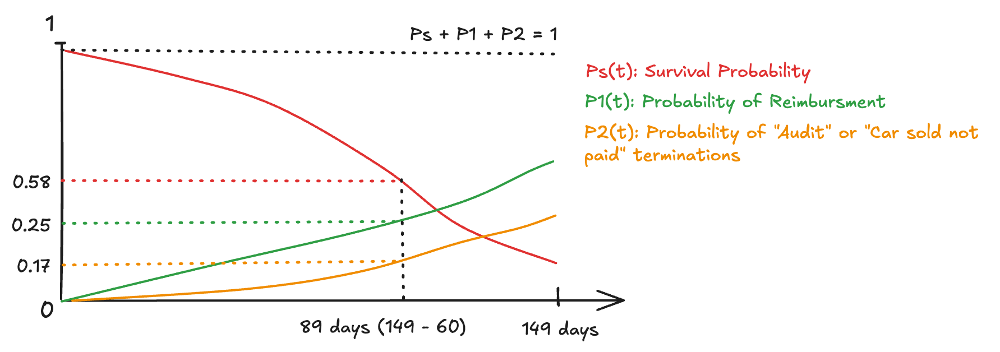

# Credit Risk Models

This repository contains a real-world data science project from a fintech startup,
which gracefully accepted to help the open-source community.
This startup provides credit lines to car dealerships which help them buy new cars on
the second-hand market.


[Context](#context)<br>
[Objectives](#objectives)<br>
[Methodology and survival analysis](#methodology-and-survival-analysis)<br>
[Time varying features](#time-varying-features)<br>
[Implementation and data engineering](#implementation-and-data-engineering)<br>


## Context

Each dealer (a.k.a borrower) can ask for multiple loans, within the limit of their
credit lines. From the moment loans are granted and the money transfered on
dealers' accounts, **dealers have 149 days to reimburse, with a single payment** 
(the reimbursment is done in one shot, after the dealer receive the money from selling
the car bought with the loan). Failing to reimburse a loan after the 149 days limit
terminates the loan, with the reason **"Maturity reached"**.

Additionally, dealers have to perform audits and checks, to prove the car they bought
is still in the parking lot of their dealership. These audits are scheduled every
30 days, and dealers have 30 days to perform them. If a dealer doesn't submit an audit
before the due date, the audit is said to be overdue. When the audit is overdue for more
than 14 days, the loan is terminated, with the reason **"Audit overdue"**.

Finally, when the dealers indicate that they successfully sold the car linked to their
loan, they only have 5 days to make a reimbursement. Failing to reimburse after 5 days
past the selling of the car also terminates the loan, with the reason
**"Car sold not paid"**.

Therefore, a loan can only be terminated because of maturity reached when its dealer
failed to sell the car (which has been bought with this loan) within the 149 days period.

Note that when a loan is reimbursed in due date (which is the happy scenario),
it is closed but not terminated. When a loan is terminated (which is the unfortunate
scenario), a collection team contacts the dealer and asks for repayment.
Then, a terminated loan may or may not get reimbursed. When it is not reimbursed after
multiple contacts with the collection team, it is considered a default, which can
then trigger legal actions.

## Objectives

Due to the increasing number of defaulting loans, the startup has two different
objectives:

**1. Projecting the total loss due to default**

With an accurate total loss projection, the startup can provision the right amount
to compensate for that loss, using this formula:

$$ \mathrm{Loss} = P(\mathrm{Default}) \times \mathrm{Total_{Exposure}} $$

Where $P(\mathrm{Default})$ represents the average probability of a dealer to default
(which result in the total of its loans to be lost), and $\mathrm{Total_{Exposure}}$
represents the total amount loaned by the startup, at risk.

A dealer can be represented as a list of loans. When they don't have any on-going loans,
their default probability is 0. However, when they have multiple on-going loans, their
default probability corresponds to the highest default probability of their loans.

```python
dealer_proba = max(loans_probas)
```

The startup considers that when a dealer defaults on a loan, they actually defaults
all their loans –if they can't reimburse a loan, they likely won't reimburse their other
loans still on-going.

**Estimating default probabilities directly is hard**, because it entails knowing the
actions, successes and failures from the collection team, with features like phone
recording or email exchanges that we don't have.

Instead, we should aim at predicting the **termination probability**, which is free of
any interaction from the collection team. We can write the default probability of each
loan as:

$$ P(\mathrm{Default}) = P(\mathrm{Termination}) \times P(\mathrm{Default} | \mathrm{Termination})$$

Where $P(\mathrm{Default} | \mathrm{Termination})$ represents the probability of
the startup failing to recollect a terminated loan. This can be determined using
simple statistics on past recollections, or later with another ML model.

**2. Flagging the dealers with the higher risk of default**

Predicting loan termination probabilities also helps the startup's customer success
managers (CSMs) to flag dealers with highly risky loans. Using per-prediction feature
importances, the CSMs can then take several actions, like refusing new loans
applications from risky dealers, or assist them in their cashflow management.

In this context, the objective is also to estimate loan termination probabilities.
By taking the max, we estimate the termination probability of dealers, and rank them
on a dashboard. Later, by getting CSMs feedback, we can define a cost matrix to set
multiple thresholds on the termination probabilities. These thresholds correspond
to different labels/buckets in which we place dealers. For instance we can define
high termination probability, medium risk and low risk buckets.

This objective also relies a lot on prediction-level interpretability for the CSMs,
using methods like LIME or SHAP.

## Methodology and survival analysis

Both objectives relies on predicting loan termination probability. Before being
reimbursed or terminated, on loan is on-going. When a loan is on-going, we can't
conclude yet on its future final status.

Therefore, we can tackle this problem with survival analysis, by considering that
on-going loans represent the survival event: the loan hasn't experienced a reimbursement
or termination yet. Since we have multiple events of different nature, we are in a
competing risks setting.

A note on the "maturity reached" termination. When a loan doesn't experience a
reimbursment or a termination before 149 days, it is automatically terminated with
a maturity reached reason. So, **we can argue than maturity reached termination is
actually surviving up to 149 days**. The direct implication is that we only have 2
different events, in addition to the survival event: reimbursment (event 1) and
termination for other reasons that maturity reached (event 2).

The figure below shows the distribution of the termination reason, before collapsing
them into survival, event 1 and event 2.

<p align="center">
    
</p>

The duration is defined as the difference between the termination or reimbursment date
and the creation date of the loan. For on-going loans, the duration is the difference
between today and the creation date.

The grey dashed bar represents the 149 day limits. Some old loans were closed past
this threshold because the limit used to be 179 days instead (the black dashed bar).

The issue with old loans is also that some features are not well defined, and they
require a lot of cleaning. We exclude these old loans to make things simpler and limit
biases.

So, by considering on-going loans and maturity reached as survival event (0),
reimbursments as (1) and termination other than maturity reached as (2), our label
distribution is:

<p align="center">
    
</p>

## Time varying features

Every day, we have to predict termination probabilities of on-going loans.
This means that every day, we will observe loans of different ages. Some might have been
just created, others might be near the 149 days limit.

For each loan, we want to build features representing their last observed information.
These features can be of multiple kinds:
- Fixed features at the loan level, for instance the amount of the loan.
- Fixed features at the dealer level, for instance the country of the dealership who
  applied for the loan.
- Time varying features at the loan level, for instance the number of audits performed
  for this loan (audits are due every 30 days), or more simply the age of the loan.
- Time varying features at the dealer level, for instance the number of on-going loans
  the dealer has, or more simply the age of the dealer.

A critical aspect of most survival analysis models is that they are not naturally
equiped to deal with time varying features. Most models assume fixed covariates,
available at the introduction of a patient to the study, and constant for its entire
lifetime. Here, the context is quite different: we consider on-going loans as if they
were entering the study everyday, with updated covariates.

### Time varying features - Training

Since some of our features (like the number of audits) vary across time, and we need
to **make predictions** for loans **at any stage of their life**, we have to reproduce
the state of a loan at different stages of its life, and evaluate our model on all
these stages.

One way to achieve this is to choose multiple observation dates, and only look at the
data prior to these dates. We would then update the duration
(which is the time-to-event to predict) accordingly.

Let’s take an example. The following loan has been reimbursed 126 days after its
creation:

<p align="center">
    
</p>

We first set the observation date as the date of the creation of the loan.

- Feature-wise, at that stage the loan hasn’t received any audits (hence 0).
- Target-wise, the duration is 126, and the loan has been reimbursed (this is what
we want the model to learn)

We then need to take the future audits into account. For this, we choose another,
posterior, observation date:

<p align="center">
    
</p>

- Feature-wise, at that stage, the loan is 74 days old, and 3 audits have already
  been performed from the start.
- The time-to-event also gets closer! The event will now happen in 126 - 74 = 52 days.

We add a new row in our features (X) and target (y) for this new observation date,
because we want the model to consider this observation to be a different loan,
which got created the 2024-03-15 with `n_audits_done=3`.

This violates the independence component in the iid assumption, but empirically this
should work fine. Again, we consider all rows to be independent.

Let’s add one last observation date to represent the very late stage of this loan:

<p align="center">
    
</p>

Note that we can create richer feature sets using different time-windows relative to
our observation dates. Let’s consider the number of audits one more time:

<p align="center">
    
</p>

Now that we get a good overview about our temporal feature aggregation mechanism
during training, let’s see how this translate for prediction.


### Time varying features - Prediction

Once our model is trained, we have to estimate termination probabilities for on-going
loans. Instead of computing features for different observation dates, we only consider
today date, since we need all features observed up to now.

<p align="center">
    
</p>

Our survival analysis model estimates probabilities from 0 to 149 days, each day, for
each loan. In other words, we predict a probability curve for each on-going loans.

However, we have to select the time horizon that makes sense for each loan.
Since we focus on the maturity reached termination, we actually want the probability
of staying event free until the 149 days limit is reached.

For instance, for a 135 days old loan, we need the default probability in
149 - 135 = 14 days ! Note that if this loan was 20 days old, we would be looking
at the probability at the 149 - 20 = 129 days instead!

<p align="center">
    
</p>

This gives the probability of termination for "maturity reached", but to estimate the
total termination probability of each on-going loan, we need to add the probability of
the other kinds of terminations (car sold not paid and audit overdue) which can happen
before the 149 days limit.

Therefore, for a single loan, whose age is 60 days, the termination probability would be
the following:

<p align="center">
    
</p>

$$P(\mathrm{termination}| \mathrm{age}=60, x) = 0.58 + 0.17 = 0.75$$


### Alternatives

Lifelines proposes another scheme to handle time varying features, using the estimator
[`CoxTimeVaryingFitter`](https://lifelines.readthedocs.io/en/latest/Time%20varying%20survival%20regression.html).
Their approach differs in that they create observation windows in which they consider
whether individuals have experienced the event or not. Hence, it doesn't seem able
to estimate probabilities for distant time horizons. This approach hasn't been tested
yet in this project.


## Implementation and data engineering

There are three main entry points for the codebase of this project:
- `plot_demo_survival.py`, which is the demo the startup data scientist team gave to
some non-technical stakeholders
- `credit_risk_models/risk_model_survival_analysis/survboost_prediction.py`, which is
the training script used to fit a survival analysis model, manually uploaded on
Azure ML. The startup plans to create a training pipeline, which would run monthly.
- `azureml_pipelines/survboost_prediction_pipeline`, which push a prediction job to
Azure ML. This job will then run daily on the cloud.

### `DatasetMaker`

The orchestrator class that stands out in this project is the
`credit_risk_models.risk_model_survival_analysis._make_dataset.DatasetMaker`.

It is responsible for creating the features X and targets y used for training, but also
the features X to use for prediction in production. As we explained above, the
difference both features is that we sample multiple observation times for each loan 
during training, whereas we use a today as a single observation date for on-going loans
on which to make a prediction.

Use `DatasetMaker(is_training=True)` to create X for training, and
`DatasetMaker(is_training=False)` to create X for daily prediction.

This class is also very handy because it stores intermediary tables in cache, using
the `functools.cached_property()` decorator. This allows:
- Reusing already computed tables, which save time on IO by not reloading data from
the database, and not reproducing all transformations
- Giving a single object with autocompletion to access these intermediary tables.
Combined with skrub TableReport, we can inspect this data engineering pipeline with
ease.

### LIME

Explainability is key to gain stakeholders' trust. Not only do they need marginal
feature importances with, e.g., `permutation_importance`, but they also ask for
feature importances at the prediction level. This is where libraries like LIME or
SHAP shine, although most data scientists have a hard time giving a sound and
statistically correct interpretation of the results of these packages.


## Setup

This project uses Poetry for dependency management. To set up:

1. Install Poetry
2. Install hazardous locally, then run `poetry install`
3. Activate the virtual environment with `poetry shell`
